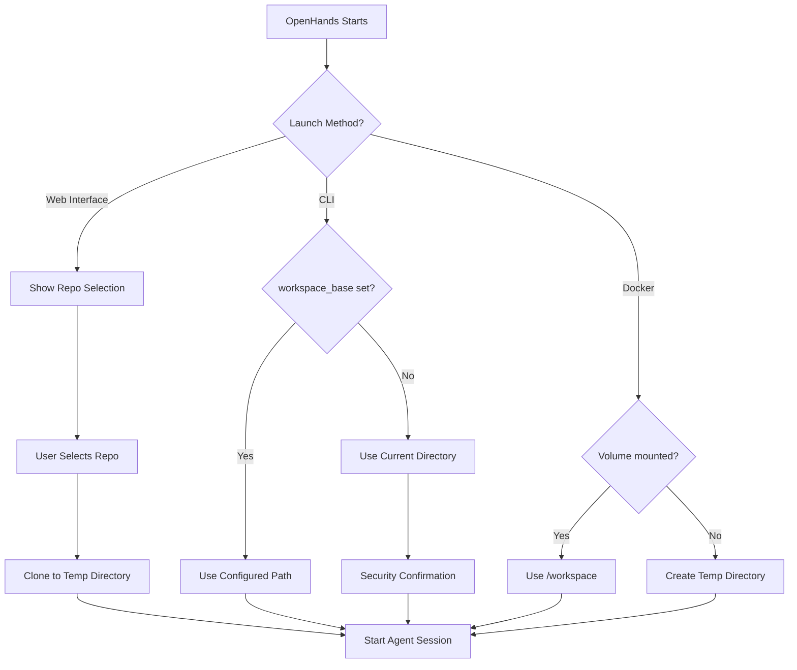

# OpenHands Workspace and Root Folder Management

## Overview

OpenHands handles workspace/project folder selection differently depending on how it's launched and configured. This document explains the various modes and default behaviors for workspace management.

## Key Concepts

### Workspace vs Working Directory
- **Workspace**: The root directory where OpenHands operates and where the AI agent can read/write files
- **Working Directory**: The current directory from which commands are executed (usually the same as workspace)
- **Sandbox Mount Path**: The path inside the Docker container where the workspace is mounted (typically `/workspace`)

## Workspace Selection Modes

### 1. Web Interface (Default Behavior)

When launching OpenHands via the web interface (`http://localhost:3000`):

#### **Repository-Based Workflow (Primary)**
- **User selects a Git repository** from GitHub/GitLab/Bitbucket via dropdown
- **Repository is cloned** into a temporary workspace directory
- **Workspace location**: Temporary directory (e.g., `/tmp/openhands_workspace_<session_id>`)
- **User workflow**:
  1. Choose Git provider (GitHub, GitLab, etc.)
  2. Search and select repository
  3. Choose branch (or use default)
  4. Click "Launch" to start conversation

#### **Empty Workspace (Alternative)**
- **No repository selected**: Creates empty temporary workspace
- **Workspace location**: Temporary directory with random session ID
- **Use case**: Starting from scratch without existing code

### 2. CLI Mode

When running `openhands` from command line:

#### **Explicit Workspace Configuration**
```bash
# Set workspace via config
openhands --workspace-base /path/to/project

# Or via environment variable
export WORKSPACE_BASE=/path/to/project
openhands
```

#### **Current Directory Default**
- **Default behavior**: Uses current working directory as workspace
- **Security check**: Prompts user to confirm directory access
- **Warning displayed**: "Agent will run in this directory and can EDIT files"

#### **Configuration File**
```toml
# config.toml
[core]
workspace_base = "/path/to/project"
```

### 3. Docker Container Mode

When running via Docker:

#### **Volume Mounting**
```bash
docker run -v /host/project:/workspace openhands
```
- **Workspace**: `/workspace` inside container
- **Host mapping**: `/host/project` on host system

#### **No Volume Mount**
- **Default**: Creates temporary workspace inside container
- **Persistence**: Lost when container stops

## Default Workspace Behavior Summary

| Launch Method | Default Workspace | User Selection Required |
|---------------|-------------------|------------------------|
| **Web Interface** | Temporary directory | Yes (Git repo selection) |
| **CLI (no config)** | Current working directory | No (but security prompt) |
| **CLI (with config)** | Configured path | No |
| **Docker (mounted)** | `/workspace` (mounted volume) | No |
| **Docker (no mount)** | Temporary container directory | No |

## Initial Directory Behavior

### When Application Starts

1. **Web Interface**:
   - Shows repository selection screen
   - No default workspace until user selects repo
   - Creates workspace when conversation starts

2. **CLI**:
   - Immediately uses current directory or configured path
   - Prompts for security confirmation if needed
   - Changes to workspace directory before starting agent

3. **Docker**:
   - Uses mounted volume or creates temp directory
   - No user interaction required

### Workspace Creation Process



## Security and Permissions

### Trusted Directories
- **CLI mode**: Prompts user to confirm workspace access
- **Configuration**: Can pre-approve directories in `~/.openhands/config.toml`
- **Warning**: Agent can read, write, and execute files in workspace

### Temporary Workspaces
- **Web mode**: Always uses temporary directories for safety
- **Cleanup**: Temporary workspaces may persist after session ends
- **Location**: Usually `/tmp/openhands_workspace_<session_id>`

## Configuration Options

### Environment Variables
```bash
WORKSPACE_BASE=/path/to/project          # Set workspace directory
WORKSPACE_MOUNT_PATH_IN_SANDBOX=/workspace  # Container mount point
```

### Config File (`config.toml`)
```toml
[core]
workspace_base = "/path/to/project"
init_git_in_empty_workspace = true  # Initialize git in empty workspaces

[sandbox]
trusted_dirs = ["/home/user/projects", "/opt/workspaces"]  # Pre-approved directories
```

### Command Line Arguments
```bash
openhands --workspace-base /path/to/project
openhands --config-file /path/to/config.toml
```

## File Access and Browsing

### Web Interface File Browser
- **Built-in file explorer**: Browse workspace files via web UI
- **File operations**: View, edit, create, delete files through interface
- **API endpoints**: `/api/conversations/{id}/list-files` for file listing

### CLI File Access
- **Direct file system access**: Agent operates directly on local files
- **No sandboxing**: Full access to workspace directory and subdirectories
- **File operations**: Standard file system operations via shell commands

## Summary for Legal Workspace Planning

For your legal drafting workspace transformation:

1. **Current behavior**: Web interface requires Git repo selection by default
2. **Modification needed**: You'll want to bypass repo selection and use a pre-configured legal case directory
3. **Recommended approach**: 
   - Configure default workspace to point to your case files directory
   - Modify frontend to skip repository selection
   - Set up folder structure for pleadings, motions, exhibits, etc.
4. **File organization**: OpenHands already has file browsing capabilities that can be adapted for legal document management
