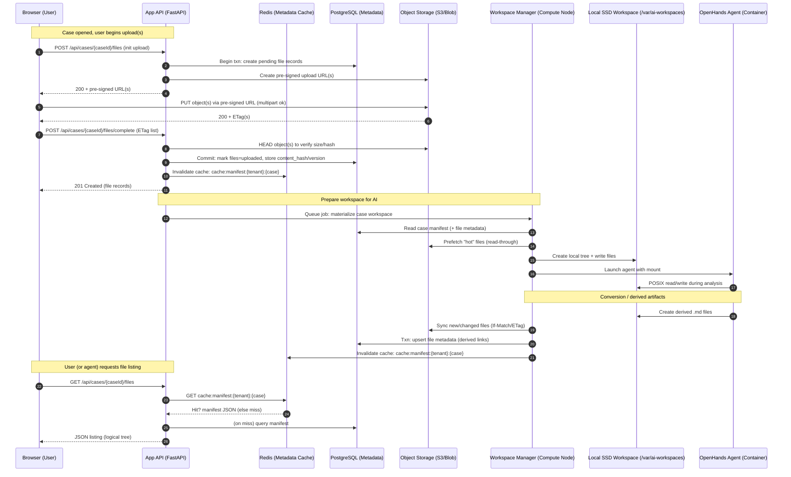

# Storage Flow Diagram: Multi‑Tenant Legal Case Management

Below is a mermaid diagram showing the end‑to‑end flow for uploads, metadata, caching, workspace preparation, AI access, and syncing to the authoritative store.

Legend:
- Authoritative storage = Object Storage (versioned)
- Fast metadata = PostgreSQL + Redis cache
- AI execution = Local SSD workspace mounted into agent container
- Consistency = ETag/If‑Match + DB transactions + cache invalidation

