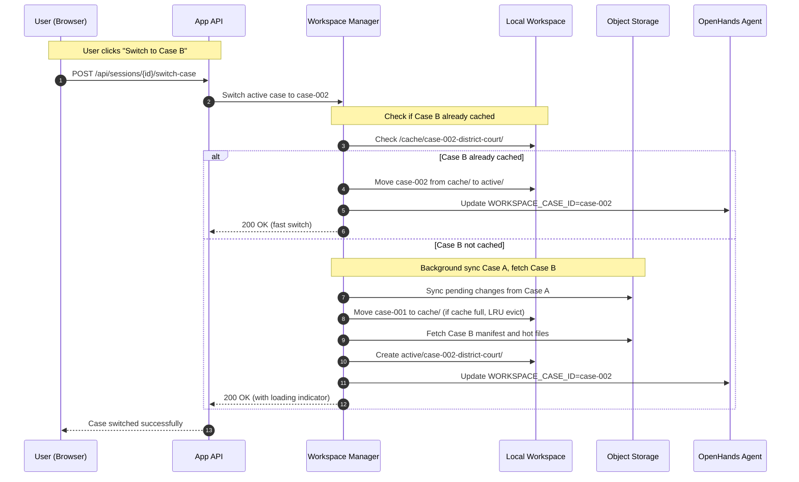

# Environment Isolation and Case Switching Architecture

This document defines the container isolation strategy and case switching workflow for our multi-tenant legal case management system.

## 1. Environment Isolation Strategy

### Recommended Approach: Per-Session Container Isolation

**Architecture**: One Docker container per active user session, not per case.

```
User Session → Single Container → Multiple Case Workspaces (mounted)
```

**Container Structure**:
```
Container: legal-session-{session_id}
├── /opt/workspace/
│   ├── case-001-estate-planning/     # Case A workspace
│   ├── case-002-district-court/      # Case B workspace
│   └── shared/                       # Shared templates/resources
├── /opt/openhands/                   # OpenHands agent runtime
└── /tmp/session/                     # Session-specific temp files
```

### Why Per-Session (Not Per-Case) Containers?

#### **Per-Session Benefits**
- **Resource Efficiency**: One container handles multiple cases; lower memory/CPU overhead
- **Fast Case Switching**: No container startup/teardown (2-5 second penalty eliminated)
- **Shared Context**: Agent can reference across cases (e.g., "use the template from the estate case")
- **Session Persistence**: User preferences, agent memory, and UI state maintained
- **Cost Optimization**: Fewer running containers = lower infrastructure costs

#### **Per-Case Container Drawbacks**
- **Startup Latency**: 2-5 seconds per case switch for container initialization
- **Resource Waste**: Each case requires dedicated container resources even when idle
- **Context Loss**: Agent loses cross-case context and learned preferences
- **Complexity**: Container orchestration becomes more complex with frequent creation/destruction

### Security Isolation Model

```
┌─────────────────────────────────────────────────────────────┐
│                    Host Security Boundary                   │
├─────────────────────────────────────────────────────────────┤
│  Container 1 (User A)    │  Container 2 (User B)           │
│  ┌─────────────────────┐ │  ┌─────────────────────┐         │
│  │ Session: sess_123   │ │  │ Session: sess_456   │         │
│  │ Cases: A1, A2, A3   │ │  │ Cases: B1, B2       │         │
│  │ User ID: user_001   │ │  │ User ID: user_002   │         │
│  └─────────────────────┘ │  └─────────────────────┘         │
└─────────────────────────────────────────────────────────────┘
```

**Isolation Guarantees**:
- **User-level isolation**: Each user gets dedicated container
- **File system isolation**: No shared mounts between user containers
- **Network isolation**: Containers cannot communicate directly
- **Resource limits**: CPU/memory quotas per container
- **Process isolation**: Standard Docker container boundaries

### Container Lifecycle Management

```python
class SessionManager:
    async def create_user_session(self, user_id: str) -> str:
        """Create new container session for user."""
        session_id = f"sess_{user_id}_{timestamp}"

        # Create container with user-specific workspace mounts
        container_config = {
            "image": "legal-workspace:latest",
            "name": f"legal-session-{session_id}",
            "volumes": {
                f"/var/legal-workspaces/{user_id}": {
                    "bind": "/opt/workspace",
                    "mode": "rw"
                }
            },
            "environment": {
                "USER_ID": user_id,
                "SESSION_ID": session_id
            },
            "resource_limits": {
                "memory": "4GB",
                "cpu": "2.0"
            }
        }

        await self.docker_client.containers.run(**container_config)
        return session_id

    async def cleanup_session(self, session_id: str):
        """Clean up container and sync final state."""
        # Sync any pending changes to object storage
        await self.sync_all_cases(session_id)

        # Stop and remove container
        await self.docker_client.containers.get(f"legal-session-{session_id}").remove(force=True)
```

## 2. Case Loading and Switching Workflow

### Multi-Case Coexistence Model (Recommended)

**Approach**: Multiple cases loaded simultaneously with intelligent caching and lazy loading.

```
Local Workspace Structure:
/var/legal-workspaces/{user_id}/
├── active/
│   ├── case-001-estate-planning/     # Currently active case
│   └── case-002-district-court/      # Recently accessed case
├── cache/
│   ├── case-003-contract-review/     # Cached but not active
│   └── case-004-personal-injury/     # Cached but not active
└── .metadata/
    ├── session.json                  # Active cases, preferences
    └── sync-status.json              # Sync state per case
```

### Case Switching Workflow

#### **Scenario**: User switches from Case A (Estate Planning) to Case B (District Court)



### Caching Strategy

#### **Active Cases** (Hot Tier)
- **Location**: `/active/` directory
- **Criteria**: Currently selected case + 1-2 recently accessed cases
- **Sync**: Real-time sync on file changes
- **Performance**: Immediate access, full file tree materialized

#### **Cached Cases** (Warm Tier)
- **Location**: `/cache/` directory
- **Criteria**: Recently accessed cases (LRU cache, configurable size)
- **Sync**: Periodic sync (every 5-10 minutes) or on explicit save
- **Performance**: 1-2 second activation time (move to active)

#### **Cold Cases** (Object Storage Only)
- **Location**: Object storage only
- **Criteria**: Cases not accessed recently
- **Sync**: On-demand fetch when accessed
- **Performance**: 3-5 second initial load time

### Cache Management

```python
class CacheManager:
    def __init__(self, max_active=2, max_cached=5):
        self.max_active = max_active
        self.max_cached = max_cached

    async def switch_to_case(self, user_id: str, case_id: str):
        """Switch active case with intelligent caching."""
        workspace_path = f"/var/legal-workspaces/{user_id}"

        # Check if case is already active
        if self.is_case_active(workspace_path, case_id):
            return await self.set_agent_context(case_id)

        # Check if case is cached
        if self.is_case_cached(workspace_path, case_id):
            await self.promote_to_active(workspace_path, case_id)
            return await self.set_agent_context(case_id)

        # Case is cold - need to fetch
        await self.fetch_case_from_storage(user_id, case_id)
        await self.promote_to_active(workspace_path, case_id)
        return await self.set_agent_context(case_id)

    async def promote_to_active(self, workspace_path: str, case_id: str):
        """Move case from cache to active tier."""
        # Ensure we don't exceed active case limit
        if len(self.get_active_cases(workspace_path)) >= self.max_active:
            await self.demote_oldest_active(workspace_path)

        # Move case directory
        cache_path = f"{workspace_path}/cache/{case_id}"
        active_path = f"{workspace_path}/active/{case_id}"
        await self.move_directory(cache_path, active_path)

        # Update metadata
        await self.update_access_time(workspace_path, case_id)
```

### Sync Strategy Details

#### **Real-time Sync (Active Cases)**
- **Trigger**: File save events, agent actions
- **Method**: Individual file upload with ETag concurrency control
- **Frequency**: Immediate (< 1 second after change)

#### **Periodic Sync (Cached Cases)**
- **Trigger**: Timer-based (5-10 minutes) or explicit user save
- **Method**: Batch upload of changed files
- **Frequency**: Configurable, default 5 minutes

#### **On-Demand Sync (Case Switch)**
- **Trigger**: User switches away from case
- **Method**: Force sync all pending changes before demotion
- **Frequency**: Once per case switch

### Performance Characteristics

| Operation | Active Case | Cached Case | Cold Case |
|-----------|-------------|-------------|-----------|
| **File Access** | < 50ms | < 50ms | 1-3 seconds |
| **Case Switch** | < 200ms | 1-2 seconds | 3-5 seconds |
| **Save Operation** | < 500ms | < 1 second | < 1 second |
| **Search/Browse** | < 100ms | < 200ms | 2-4 seconds |

### Memory and Storage Management

#### **Local Storage Allocation**
```
Per-User Workspace Allocation:
├── Active Cases: 2 × 500MB = 1GB
├── Cached Cases: 5 × 200MB = 1GB
├── Temp/Derived: 500MB
└── Total per user: ~2.5GB
```

#### **Eviction Policies**
- **Active → Cache**: When user switches to different case
- **Cache → Cold**: LRU eviction when cache limit exceeded
- **Emergency Cleanup**: If disk usage > 80%, force sync and evict oldest cached cases

### Error Handling and Recovery

#### **Sync Failures**
- **Retry Logic**: Exponential backoff for transient failures
- **Conflict Resolution**: ETag-based optimistic concurrency with user merge prompts
- **Offline Mode**: Continue working locally, sync when connectivity restored

#### **Container Failures**
- **Session Recovery**: Recreate container and restore from last known sync state
- **Data Loss Prevention**: Periodic checkpoint sync every 10 minutes for active cases
- **Graceful Degradation**: Fall back to single-case mode if multi-case caching fails

## Implementation Recommendations

### Phase 1: Single Active Case
- Implement basic case switching with full sync/load cycle
- One case active at a time, others stored in object storage only
- Simpler to implement and debug

### Phase 2: Multi-Case Caching
- Add warm cache tier for recently accessed cases
- Implement intelligent promotion/demotion logic
- Background sync for cached cases

### Phase 3: Advanced Features
- Cross-case search and reference capabilities
- Shared templates and resources across cases
- Advanced conflict resolution and merge tools

## Storage Limits and Case Management

### Realistic Case Limits (50+ Cases Scenario)

**Problem**: A user with 50 active cases cannot have all cases cached locally due to storage and memory constraints.

**Solution**: Intelligent tiered caching with configurable limits.

```
Local Storage Allocation (per user):
├── Active Tier: 1-2 cases (currently working) = ~1GB
├── Warm Cache: 5-8 recent cases = ~2GB
├── Cold Storage: Object storage only
└── Total Local: ~3GB per user maximum
```

### Case Prioritization Algorithm

```python
class CasePrioritization:
    def __init__(self):
        self.max_active = 2
        self.max_cached = 8
        self.cache_size_limit_gb = 3

    def prioritize_cases(self, user_cases: List[Case]) -> Dict[str, List[Case]]:
        """Determine which cases stay local vs remote."""

        # Sort by priority score
        scored_cases = []
        for case in user_cases:
            score = self.calculate_priority_score(case)
            scored_cases.append((score, case))

        scored_cases.sort(reverse=True)  # Highest priority first

        # Allocate to tiers
        active = scored_cases[:self.max_active]
        cached = scored_cases[self.max_active:self.max_active + self.max_cached]
        cold = scored_cases[self.max_active + self.max_cached:]

        return {
            'active': [case for _, case in active],
            'cached': [case for _, case in cached],
            'cold': [case for _, case in cold]
        }

    def calculate_priority_score(self, case: Case) -> float:
        """Calculate case priority for local caching."""
        score = 0

        # Recency (most important factor)
        days_since_access = (datetime.now() - case.last_accessed).days
        score += max(0, 100 - days_since_access * 2)  # 100 points, -2 per day

        # User-pinned cases
        if case.is_pinned:
            score += 50

        # Case activity level
        score += min(case.recent_file_changes * 5, 25)  # Up to 25 points

        # Case size penalty (prefer smaller cases in cache)
        size_gb = case.size_bytes / (1024**3)
        score -= size_gb * 10  # -10 points per GB

        # Deadline urgency
        if case.has_upcoming_deadline(days=7):
            score += 30

        return score
```

### Cache Eviction Strategy

**When to evict cases from local storage:**
1. **Size limit exceeded**: Total local storage > 3GB per user
2. **Case limit exceeded**: More than 8 cached cases
3. **Inactivity**: Case not accessed for 14+ days
4. **Manual user action**: User explicitly "unloads" a case

**Eviction process:**
1. Sync all pending changes to object storage
2. Verify sync completion with checksums
3. Remove local files
4. Update metadata to mark case as "cold"

## Authentication to Workspace Lifecycle

### Container Lifecycle States

```
User States:
├── Unauthenticated: No container exists
├── Authenticated: Container provisioned but no active case
├── Case Active: Container running with workspace mounted
└── Session Ended: Container cleanup scheduled
```

### Detailed Lifecycle Flow

#### **Step 1: User Authentication**
```
User Login → JWT Token → User Profile Loaded
```
- **No container exists yet**
- Authentication happens at the web application level
- User sees case selection interface

#### **Step 2: Container Provisioning (On First Case Selection)**
```
User Selects Case → Container Provisioned → Workspace Mounted
```

**Trigger**: User clicks on their first case of the session

**Container Creation Process**:
```python
async def provision_user_container(user_id: str, initial_case_id: str):
    """Provision container when user first selects a case."""

    session_id = f"sess_{user_id}_{int(time.time())}"

    # Create user workspace directory on host
    workspace_path = f"/var/legal-workspaces/{user_id}"
    os.makedirs(workspace_path, exist_ok=True)

    # Fetch initial case from object storage
    await fetch_case_to_workspace(user_id, initial_case_id, workspace_path)

    # Create container with mounted workspace
    container = await docker_client.containers.run(
        image="legal-workspace:latest",
        name=f"legal-session-{session_id}",
        detach=True,
        volumes={
            workspace_path: {"bind": "/opt/workspace", "mode": "rw"}
        },
        environment={
            "USER_ID": user_id,
            "SESSION_ID": session_id,
            "ACTIVE_CASE_ID": initial_case_id
        },
        mem_limit="4g",
        cpu_quota=200000  # 2 CPU cores max
    )

    # Store session mapping
    await store_session_mapping(user_id, session_id, container.id)

    return session_id
```

#### **Step 3: Workspace Initialization**
```
Container Started → Case Files Materialized → Agent Ready
```

**Timeline**: 3-5 seconds for container + initial case loading

#### **Step 4: Session Persistence**
**Container Lifetime**: Persistent during user session, ephemeral between sessions

**Session Management**:
```python
class SessionManager:
    def __init__(self):
        self.active_sessions = {}  # user_id -> session_info
        self.session_timeout = 3600  # 1 hour idle timeout

    async def handle_user_logout(self, user_id: str):
        """Clean up user session on logout."""
        session = self.active_sessions.get(user_id)
        if session:
            # Sync all pending changes
            await self.sync_all_user_cases(user_id)

            # Stop and remove container
            await self.cleanup_container(session['container_id'])

            # Clean up workspace (optional - can persist for quick resume)
            await self.cleanup_workspace(user_id, keep_recent=True)

            del self.active_sessions[user_id]

    async def handle_session_timeout(self, user_id: str):
        """Handle idle session cleanup."""
        # Same as logout but with different logging
        await self.handle_user_logout(user_id)
```

### Multi-User Scenario (5 Active Users)

**Resource Allocation**:
```
Server Resources (example):
├── Total RAM: 32GB
├── Per-user allocation: 4GB (container + workspace cache)
├── System overhead: 12GB
├── Available for 5 users: 20GB ✓

Total Storage:
├── User workspaces: 5 users × 3GB = 15GB
├── Container images: ~2GB
├── System: ~10GB
├── Total needed: ~27GB (plan for 50GB+ SSD)
```

**Container States**:
```
Active Containers (5 users logged in):
├── legal-session-sess_user001_1699123456 (User A - 2 active cases)
├── legal-session-sess_user002_1699123789 (User B - 1 active case)
├── legal-session-sess_user003_1699124012 (User C - 3 active cases)
├── legal-session-sess_user004_1699124234 (User D - 1 active case)
└── legal-session-sess_user005_1699124456 (User E - 2 active cases)
```

### Exact Transition Points

**Authentication → Container Provisioning**:
- **Trigger**: User selects their first case (not at login)
- **Timing**: 3-5 seconds for container creation + case loading
- **User Experience**: Loading spinner with "Preparing your workspace..."

**Container → Workspace Access**:
- **Trigger**: Container reports ready + initial case materialized
- **Timing**: Immediate once container is ready
- **User Experience**: Case interface loads, file browser populated

**Session End → Cleanup**:
- **Trigger**: User logout OR idle timeout (1 hour default)
- **Timing**: Immediate sync + container removal (30 seconds)
- **User Experience**: "Saving your work..." then redirect to login

### Optimization: Container Pre-warming (Optional)

For better user experience, consider pre-warming containers:

```python
async def prewarm_container_pool():
    """Maintain pool of ready containers for faster user onboarding."""

    # Keep 2-3 warm containers ready
    warm_pool_size = min(3, max_concurrent_users // 2)

    for i in range(warm_pool_size):
        container = await create_base_container(f"warm-pool-{i}")
        await self.warm_container_pool.put(container)

async def assign_prewarmed_container(user_id: str, case_id: str):
    """Assign pre-warmed container to user for faster startup."""

    if not self.warm_container_pool.empty():
        container = await self.warm_container_pool.get()

        # Customize container for user
        await configure_container_for_user(container, user_id, case_id)

        # Replace in warm pool
        asyncio.create_task(self.create_replacement_warm_container())

        return container
    else:
        # Fall back to normal provisioning
        return await provision_user_container(user_id, case_id)
```

This architecture provides clear separation between authentication (web app level) and workspace provisioning (container level), with intelligent case caching that scales to users with many cases while maintaining responsive performance.

This architecture provides the flexibility legal professionals need while maintaining security isolation and optimal performance for case switching workflows.
