# JQv2 System Architecture

## Overview

JQv2 is a specialized legal document management system built on top of OpenHands (formerly OpenDevin) that provides instant AI agent startup times and professional-grade legal workflow capabilities. This document provides a comprehensive overview of the system architecture, design decisions, and implementation details.

## High-Level Architecture

```mermaid
graph TB
    subgraph "Client Layer"
        UI[Legal Case Management UI]
        API_CLIENT[API Client Layer]
        HOOKS[React Query Hooks]
    end
    
    subgraph "API Gateway"
        ROUTES[Legal API Routes]
        MIDDLEWARE[Authentication & Validation]
        CORS[CORS Handler]
    end
    
    subgraph "Business Logic Layer"
        LWM[Legal Workspace Manager]
        ROL[Runtime Optimization Layer]
        DTS[Document Template System]
        AUDIT[Audit & Logging]
    end
    
    subgraph "OpenHands Core (Modified)"
        SESSION[Session Management]
        AGENTS[Agent Controllers]
        EVENTS[Event System]
        RUNTIME_SEL[Runtime Selection]
    end
    
    subgraph "Runtime Layer"
        LOCAL[LocalRuntime ⚡]
        DOCKER[DockerRuntime]
        TMUX[tmux Sessions]
    end
    
    subgraph "Storage Layer"
        CASE_STORE[Legal Case Store]
        TEMPLATES[Document Templates]
        WORKSPACE[Workspace Files]
        AUDIT_LOG[Audit Logs]
    end
    
    UI --> API_CLIENT
    API_CLIENT --> HOOKS
    HOOKS --> ROUTES
    ROUTES --> MIDDLEWARE
    MIDDLEWARE --> LWM
    LWM --> ROL
    ROL --> SESSION
    SESSION --> RUNTIME_SEL
    RUNTIME_SEL --> LOCAL
    RUNTIME_SEL --> DOCKER
    LOCAL --> TMUX
    LWM --> CASE_STORE
    DTS --> TEMPLATES
    SESSION --> AGENTS
    AGENTS --> EVENTS
    EVENTS --> AUDIT
    AUDIT --> AUDIT_LOG
    LWM --> WORKSPACE
```



## Core Components

### 1. Frontend Architecture

#### Component Hierarchy

```
src/
├── components/
│   ├── features/
│   │   └── legal-cases/
│   │       ├── LegalCaseHeader.tsx
│   │       ├── CaseList.tsx
│   │       ├── CaseCard.tsx
│   │       ├── CreateCaseModal.tsx
│   │       └── RuntimeStatusIndicator.tsx
│   ├── ui/
│   │   ├── Button.tsx
│   │   ├── Modal.tsx
│   │   └── LoadingSpinner.tsx
│   └── layout/
│       ├── Header.tsx
│       ├── Sidebar.tsx
│       └── Layout.tsx
├── api/
│   ├── legal-cases.ts
│   ├── types.ts
│   └── client.ts
├── hooks/
│   ├── mutation/
│   │   └── use-legal-cases.ts
│   └── query/
│       └── use-legal-cases.ts
├── store/
│   ├── legal-cases.ts
│   └── runtime-status.ts
└── utils/
    ├── api.ts
    ├── validation.ts
    └── constants.ts
```

#### State Management

```typescript
// Legal Case State Management
interface LegalCaseState {
  cases: LegalCase[];
  currentCase: LegalCase | null;
  isLoading: boolean;
  error: string | null;
  systemStatus: SystemStatus;
}

// Runtime Status State
interface RuntimeStatusState {
  currentRuntime: 'local' | 'docker' | null;
  startupTime: number | null;
  isOptimized: boolean;
  performanceMetrics: PerformanceMetrics;
}
```

#### API Integration

```typescript
// Type-safe API client
class LegalCaseAPI {
  private baseUrl = '/api/legal';

  async getCases(): Promise<LegalCase[]> {
    const response = await fetch(`${this.baseUrl}/cases`);
    if (!response.ok) throw new APIError(response);
    return response.json();
  }

  async createCase(data: CreateCaseRequest): Promise<LegalCase> {
    const response = await fetch(`${this.baseUrl}/cases`, {
      method: 'POST',
      headers: { 'Content-Type': 'application/json' },
      body: JSON.stringify(data),
    });
    if (!response.ok) throw new APIError(response);
    return response.json();
  }

  async enterCaseWorkspace(caseId: string): Promise<WorkspaceInfo> {
    const response = await fetch(`${this.baseUrl}/cases/${caseId}/enter`, {
      method: 'POST',
    });
    if (!response.ok) throw new APIError(response);
    return response.json();
  }
}
```

### 2. Backend Architecture

#### API Layer

```python
# FastAPI route structure
@router.get("/cases", response_model=List[LegalCase])
async def list_cases() -> List[LegalCase]:
    """List all legal cases."""
    return await legal_case_store.list_cases()

@router.post("/cases", response_model=LegalCase)
async def create_case(case_data: CreateCaseRequest) -> LegalCase:
    """Create a new legal case."""
    return await legal_case_store.create_case(case_data)

@router.post("/cases/{case_id}/enter", response_model=WorkspaceInfo)
async def enter_case_workspace(case_id: str) -> WorkspaceInfo:
    """Enter a legal case workspace."""
    workspace_manager = get_legal_workspace_manager()
    return await workspace_manager.enter_case_workspace(case_id)
```

#### Legal Workspace Manager

```python
class LegalWorkspaceManager:
    """Manages legal case workspaces and runtime optimization."""
    
    def __init__(self, config: OpenHandsConfig):
        self.config = config
        self.current_case_id: Optional[str] = None
        self.workspace_root = os.environ.get('LEGAL_WORKSPACE_ROOT', '/tmp/legal_workspace')
        self.draft_system_path = os.environ.get('DRAFT_SYSTEM_PATH', '/tmp/draft_system')
    
    async def enter_case_workspace(self, case_id: str) -> Dict[str, Any]:
        """Enter a legal case workspace with runtime optimization."""
        
        # Get or create case
        case = await self._get_or_create_case(case_id)
        
        # Configure runtime optimization
        self._configure_runtime_for_case(case_id)
        
        # Set up workspace
        workspace_path = await self._setup_case_workspace(case)
        
        # Initialize draft system
        await self._initialize_draft_system(case)
        
        # Update current context
        self.current_case_id = case_id
        
        return {
            'case_id': case_id,
            'workspace_path': workspace_path,
            'runtime_type': 'local',
            'draft_system_initialized': True,
            'startup_time': self._get_startup_time()
        }
    
    def _configure_runtime_for_case(self, case_id: str) -> None:
        """Configure LocalRuntime for instant startup."""
        if self._should_use_local_runtime(case_id):
            self.config.runtime = "local"
            logger.info(f"🏛️ Configured LocalRuntime for case {case_id}")
```

#### Runtime Optimization Layer

```python
class RuntimeOptimizer:
    """Handles intelligent runtime selection and optimization."""
    
    def __init__(self):
        self.performance_metrics = PerformanceMetrics()
        self.session_cache = SessionCache()
    
    def determine_optimal_runtime(self, context: RuntimeContext) -> str:
        """Determine the optimal runtime based on context."""
        
        # Legal case detection
        if self._is_legal_case_context(context):
            self.performance_metrics.record_decision('local', 'legal_case_detected')
            return 'local'
        
        # Development context detection
        if self._is_development_context(context):
            self.performance_metrics.record_decision('docker', 'development_context')
            return 'docker'
        
        # Default to configured runtime
        return context.config.runtime
    
    def _is_legal_case_context(self, context: RuntimeContext) -> bool:
        """Detect legal case context using multiple signals."""
        signals = [
            self._check_session_id_pattern(context.session_id),
            self._check_workspace_path(context.workspace_path),
            self._check_environment_variables(),
            self._check_legal_workspace_manager_state()
        ]
        
        return any(signals)
```

### 3. Storage Architecture

#### Legal Case Store

```python
class FileLegalCaseStore(LegalCaseStore):
    """File-based storage for legal cases."""
    
    def __init__(self, workspace_root: str, draft_system_path: str):
        self.workspace_root = Path(workspace_root)
        self.draft_system_path = Path(draft_system_path)
        self.cases_dir = self.workspace_root / "cases"
        self.system_dir = self.workspace_root / "system"
        
        # Initialize directory structure
        self._initialize_storage()
    
    async def create_case(self, case_data: CreateCaseRequest) -> LegalCase:
        """Create a new legal case with workspace setup."""
        
        case = LegalCase(
            case_id=str(uuid.uuid4()),
            title=case_data.title,
            case_number=case_data.case_number,
            description=case_data.description,
            created_at=datetime.now(timezone.utc),
            updated_at=datetime.now(timezone.utc)
        )
        
        # Create case workspace
        case_workspace = await self._create_case_workspace(case)
        case.workspace_path = str(case_workspace)
        
        # Save case metadata
        await self._save_case_metadata(case)
        
        # Initialize audit log
        await self._create_audit_entry(case.case_id, 'case_created', case_data.dict())
        
        return case
    
    def _initialize_storage(self) -> None:
        """Initialize storage directory structure."""
        directories = [
            self.cases_dir,
            self.system_dir / "backups",
            self.system_dir / "versions",
            self.system_dir / "audit_logs",
            self.workspace_root / "files"
        ]
        
        for directory in directories:
            directory.mkdir(parents=True, exist_ok=True)
```

#### Document Template System

```python
class DocumentTemplateSystem:
    """Manages legal document templates and draft system integration."""
    
    def __init__(self, draft_system_path: str):
        self.draft_system_path = Path(draft_system_path)
        self.templates_dir = self.draft_system_path / "templates"
        self.documents_dir = self.draft_system_path / "documents"
        
        self._initialize_template_system()
    
    async def initialize_case_templates(self, case_id: str) -> Dict[str, Any]:
        """Initialize templates for a specific case."""
        
        case_template_dir = self.templates_dir / f"case-{case_id}"
        case_template_dir.mkdir(parents=True, exist_ok=True)
        
        # Copy default templates
        default_templates = await self._get_default_templates()
        for template in default_templates:
            await self._copy_template_to_case(template, case_template_dir)
        
        # Create case-specific document directory
        case_docs_dir = self.documents_dir / f"case-{case_id}"
        case_docs_dir.mkdir(parents=True, exist_ok=True)
        
        return {
            'templates_path': str(case_template_dir),
            'documents_path': str(case_docs_dir),
            'available_templates': [t.name for t in default_templates]
        }
```

### 4. Runtime Layer Architecture

#### LocalRuntime Implementation

```python
class LocalRuntime(Runtime):
    """Optimized local runtime for legal workflows."""
    
    def __init__(self, config: OpenHandsConfig, event_stream: EventStream, sid: str):
        super().__init__(config, event_stream, sid)
        self.session_name = f"openhands-{sid}"
        self.tmux_session = None
        self.startup_metrics = StartupMetrics()
    
    async def connect(self) -> None:
        """Connect with performance monitoring."""
        start_time = time.time()
        
        try:
            # Create or reuse tmux session
            await self._create_or_reuse_session()
            
            # Configure environment
            await self._setup_environment()
            
            # Verify connectivity
            await self._verify_connection()
            
            startup_time = time.time() - start_time
            self.startup_metrics.record_startup(startup_time)
            
            logger.info(f"⚡ LocalRuntime startup completed in {startup_time:.2f}s")
            
        except Exception as e:
            logger.error(f"LocalRuntime connection failed: {e}")
            raise RuntimeError(f"Failed to connect LocalRuntime: {e}")
    
    async def _create_or_reuse_session(self) -> None:
        """Create new tmux session or reuse existing one."""
        
        # Check for existing session
        if await self._session_exists():
            logger.info(f"♻️ Reusing existing tmux session: {self.session_name}")
            return
        
        # Create new session
        await self._create_new_session()
        logger.info(f"🆕 Created new tmux session: {self.session_name}")
```

#### Session Management

```python
class SessionManager:
    """Manages OpenHands sessions with legal context awareness."""
    
    def __init__(self):
        self.active_sessions: Dict[str, SessionInfo] = {}
        self.legal_sessions: Set[str] = set()
        self.runtime_optimizer = RuntimeOptimizer()
    
    async def create_session(self, sid: str, config: OpenHandsConfig) -> Session:
        """Create session with optimal runtime selection."""
        
        # Determine optimal runtime
        runtime_context = RuntimeContext(
            session_id=sid,
            config=config,
            workspace_path=config.workspace_base
        )
        
        optimal_runtime = self.runtime_optimizer.determine_optimal_runtime(runtime_context)
        
        # Override config if optimization is beneficial
        if optimal_runtime != config.runtime:
            config.runtime = optimal_runtime
            logger.info(f"🔄 Runtime optimized: {optimal_runtime} for session {sid}")
        
        # Create session
        session = await self._create_session_with_runtime(sid, config)
        
        # Track legal sessions
        if optimal_runtime == 'local':
            self.legal_sessions.add(sid)
        
        self.active_sessions[sid] = SessionInfo(
            session=session,
            runtime_type=optimal_runtime,
            created_at=datetime.now(),
            is_legal_context=sid in self.legal_sessions
        )
        
        return session
```

## Data Flow Architecture

### Request Flow


### Event Flow


## Performance Architecture

### Optimization Strategies

1. **Runtime Selection Optimization**
   - Intelligent context detection
   - Automatic LocalRuntime for legal cases
   - Fallback to DockerRuntime when needed

2. **Session Caching**
   - tmux session reuse
   - Workspace state persistence
   - Template caching

3. **Resource Management**
   - Process-level isolation
   - Memory optimization
   - CPU usage monitoring

4. **Network Optimization**
   - API response caching
   - WebSocket for real-time updates
   - Compression for large payloads

### Performance Monitoring

```python
class PerformanceMonitor:
    """Monitors system performance and optimization effectiveness."""
    
    def __init__(self):
        self.metrics = {
            'startup_times': [],
            'runtime_selections': {},
            'resource_usage': {},
            'user_satisfaction': {}
        }
    
    def record_startup_time(self, runtime_type: str, startup_time: float) -> None:
        """Record runtime startup time."""
        self.metrics['startup_times'].append({
            'runtime_type': runtime_type,
            'startup_time': startup_time,
            'timestamp': datetime.now()
        })
        
        # Alert if startup time exceeds threshold
        if startup_time > 10.0:  # 10 seconds threshold
            self._alert_slow_startup(runtime_type, startup_time)
    
    def get_performance_summary(self) -> Dict[str, Any]:
        """Generate performance summary report."""
        return {
            'average_startup_time': self._calculate_average_startup_time(),
            'runtime_distribution': self._get_runtime_distribution(),
            'optimization_effectiveness': self._calculate_optimization_effectiveness(),
            'resource_efficiency': self._calculate_resource_efficiency()
        }
```

## Security Architecture

### Security Layers

1. **Network Security**
   - HTTPS/TLS encryption
   - CORS configuration
   - Rate limiting

2. **Application Security**
   - Input validation
   - SQL injection prevention
   - XSS protection

3. **Runtime Security**
   - Process isolation
   - File system restrictions
   - Resource limits

4. **Data Security**
   - Encryption at rest
   - Audit logging
   - Access controls

### Security Implementation

```python
class SecurityManager:
    """Manages security aspects of the legal system."""
    
    def __init__(self):
        self.access_logger = AccessLogger()
        self.validator = InputValidator()
        self.encryptor = DataEncryptor()
    
    async def validate_case_access(self, user_id: str, case_id: str) -> bool:
        """Validate user access to legal case."""
        
        # Log access attempt
        self.access_logger.log_access_attempt(user_id, case_id)
        
        # Check permissions
        has_access = await self._check_case_permissions(user_id, case_id)
        
        if not has_access:
            self.access_logger.log_access_denied(user_id, case_id)
            raise PermissionError(f"Access denied to case {case_id}")
        
        self.access_logger.log_access_granted(user_id, case_id)
        return True
    
    def secure_workspace_path(self, case_id: str, requested_path: str) -> str:
        """Ensure workspace path is within allowed boundaries."""
        
        # Validate path format
        if not self.validator.is_valid_path(requested_path):
            raise ValueError("Invalid path format")
        
        # Ensure path is within case workspace
        case_workspace = self._get_case_workspace_root(case_id)
        normalized_path = os.path.normpath(requested_path)
        
        if not normalized_path.startswith(case_workspace):
            raise SecurityError("Path outside case workspace")
        
        return normalized_path
```

## Scalability Architecture

### Horizontal Scaling

1. **Load Balancing**
   - Multiple application instances
   - Session affinity for legal cases
   - Health check endpoints

2. **Database Scaling**
   - Read replicas for case metadata
   - Sharding by case ID
   - Caching layer

3. **Storage Scaling**
   - Distributed file systems
   - Object storage for documents
   - CDN for static assets

### Vertical Scaling

1. **Resource Optimization**
   - Memory usage optimization
   - CPU utilization monitoring
   - Disk I/O optimization

2. **Performance Tuning**
   - Database query optimization
   - API response caching
   - Background job processing

This architecture provides a solid foundation for the JQv2 Legal Document Management System, ensuring high performance, security, and scalability while maintaining the core benefits of instant startup times for legal workflows.
